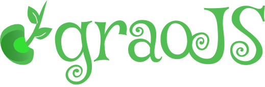

graojs-visual
=============

About graoJS Visual
-----------------

This project contains visual elements and theme for [graoJS](github.com/synackbr/graojs).

Logo
----

Character Font: [Google Mystery Quest](http://www.google.com/fonts/specimen/Mystery+Quest),
Designed by Dave 'Squid' Cohen, licensed under 
[SIL Open Font License, 1.1](http://scripts.sil.org/cms/scripts/page.php?site_id=nrsi&id=OFL).

* Logo (SVG)

* Logo + Text (SVG)

* Logo (PNG)

* Logo + Text (PNG)

Favicon
------

Created with [Favicon Generator](http://favicon-generator.org/).

logo/favicon.ico

To use, put on `<head>` section:

    <link rel="shortcut icon" href="/favicon.ico" type="image/x-icon">
    <link rel="icon" href="/favicon.ico" type="image/x-icon">

Theme
-----

The [Twitter Bootstrap 3](http://getbootstrap.com/) *graoJS theme* 
was built with [Bootswatch](http://bootswatch.com/),
under [Cosmo](http://bootswatch.com/cosmo/) theme.

For customization, enter on `theme` directory and follow the
[Bootswach Help]() instructions.
